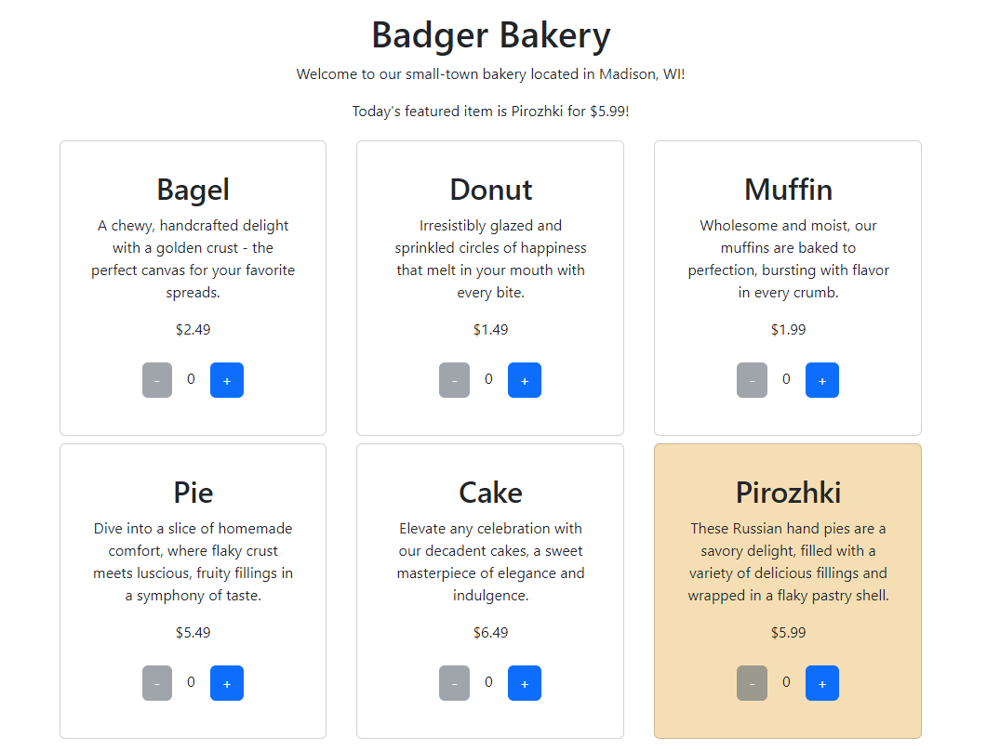
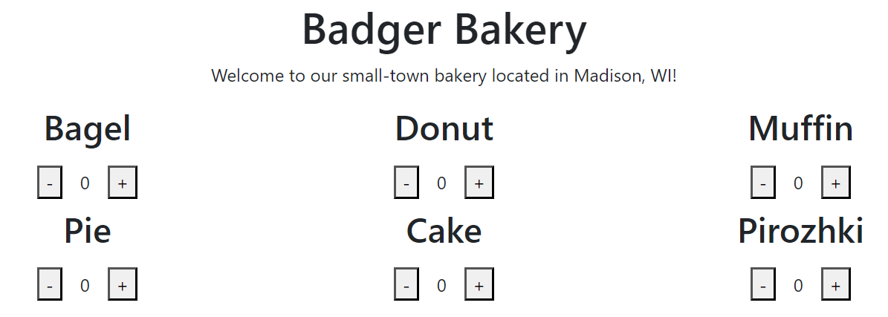
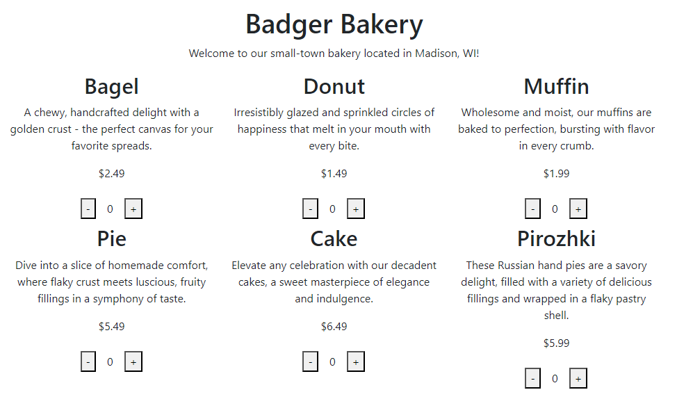
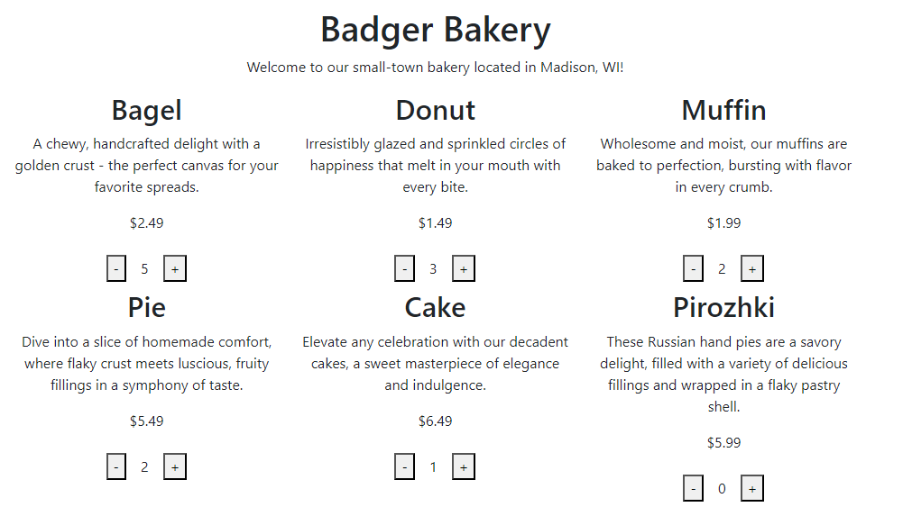
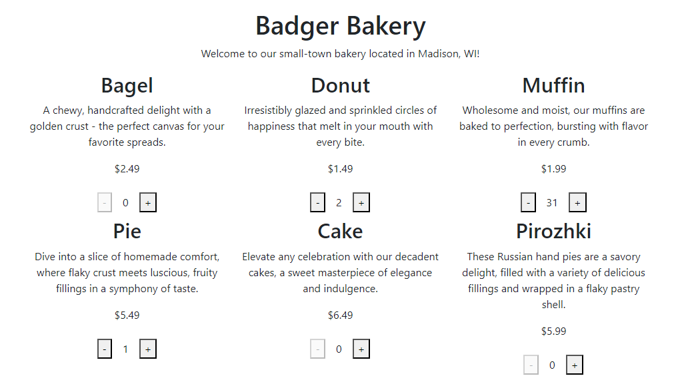
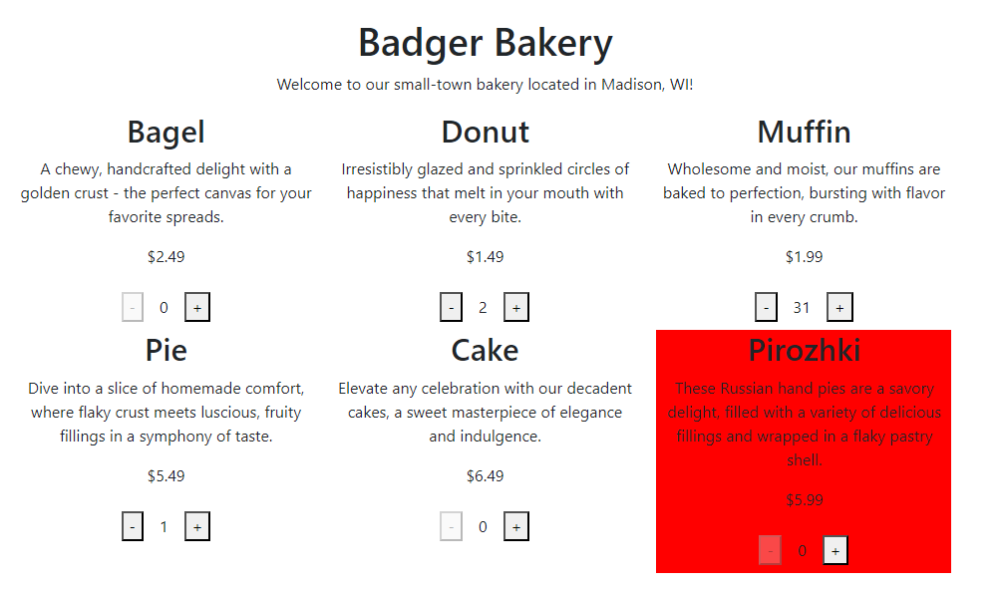
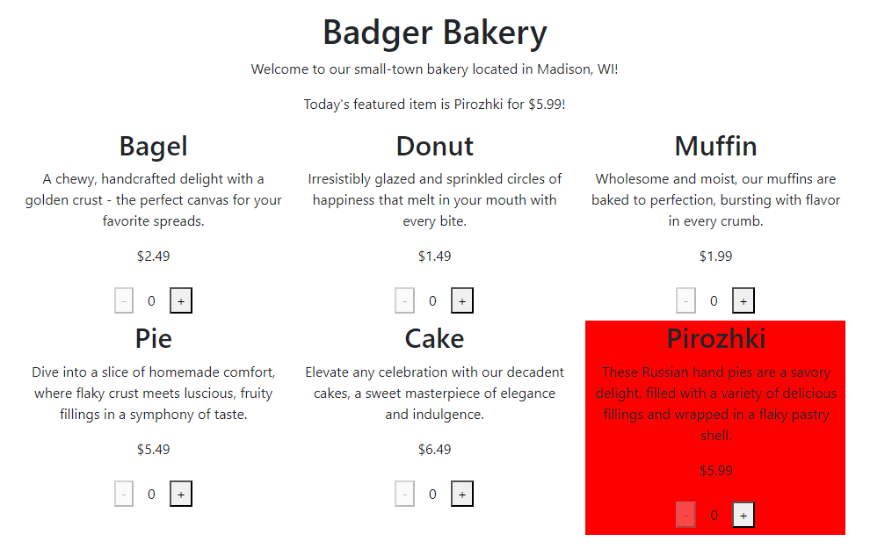
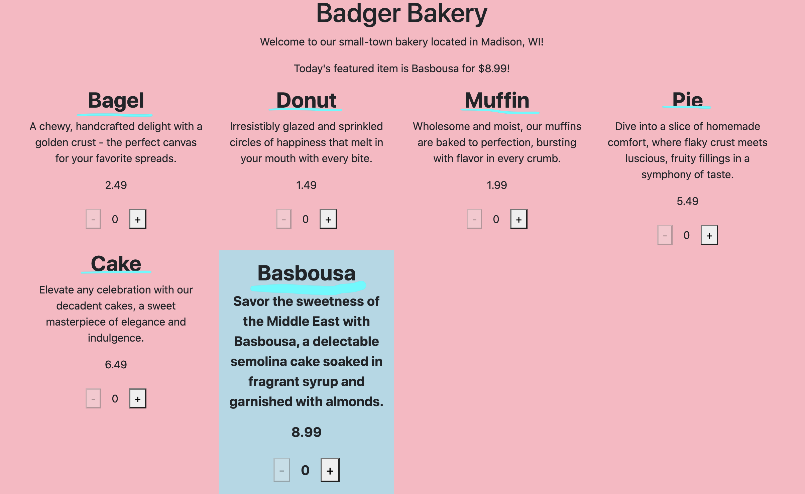

[](https://classroom.github.com/online_ide?assignment_repo_id=12177291&assignment_repo_type=AssignmentRepo)

# CS571-F23 HW3: Badger Bakery

Welcome back to Badger Bakery! In this homework, you'll create a new version of Badger Bakery using an API and React. In addition, you'll be fetching the bakery data rather than hardcoding it into the HTML. Finally, you will apply your knowledge of visual design to make a more eye-appealing webpage.

**Note:** The steps below show a barebones design. It's up to you (in the _visual design_ portion of the assignment) to make a better design. See below for an _example_ final solution.



## Setup

The starter code provided to you was generated using [vite](https://vitejs.dev/guide/). Furthermore, [bootstrap](https://www.npmjs.com/package/bootstrap) and [react-bootstrap](https://www.npmjs.com/package/react-bootstrap) have already been installed. **You should _not_ re-run the npm create vite command**. Instead, in this directory, simply run...

```bash
npm installnp
npm run dev
```

Then, in a browser, open `localhonpst:5173`. You should _not_ open index.html in a browser; React works differently than traditional web programming! When you save your changes, they appear in the browser automatically. I recommend using [Visual Studio Code](https://code.visualstudio.com/) to do your development work.

The two components you will be working with, `BadgerBakery.jsx` and `BakedGood.jsx`, are located in the `components` folder.

## React Fundamentals

### 0. Fetch Baked Goods

**This step has already been done for you!**

In `BadgerBakery.jsx`, we use the `useEffect` hook to fetch data from the API and save it to a state variable `bakedGoods`. We then use `map` to display each `BakedGood`. In addition, we pass all four of the baked good attributes (`name`, `description`, `price`, and `featured`) to `BakedGood` as props.

In HW4, you will need to do something similar; for now this is given to you!



### 1. Display Baked Good Information

In `BakedGood.jsx`, in addition to the baked good's name, display its price and description.



### 2. Allow Adding/Removing of Baked Goods

In `BakedGood.jsx`, allow the user to be able to add and remove baked goods via the "+" and "-" buttons. Clicking "+" should increase the quantity while clicking "-" should decrease the quantity.

**Hint:** It may be helpful to replace the hardcoded 0 with a state variable which is changed by the `onClick` attribute of the buttons.



### 3. Prevent User Error

In `BakedGood.jsx`, add a `disabled` prop to the "-" button that disables the "-" button if the quantity is at or below `0`. There is no maximum number of items a user may add to their basket.



### 4. Highlight Featured Item

In `BakedGood.jsx`, highlight today's featured baked good by making its styling distinct from the other items. For example, you could change the background color, the font boldness, or anything else to distinguish it from the others.

A baked good is considered featured if its `featured` prop is `true`.



### 5. Fetch Featured Item

In `BadgerBakery.jsx`, display a line that says...

Today's featured item is ITEM for $PRICE!

...where ITEM and PRICE are replaced with the featured item name and price. You can do this by _either_ (1) fetching the featured item from `https://cs571.org/api/f23/hw3/featured-baked-good` or (2) finding the featured item in the `bakedGoods` array. If you decide to find the featured item in the `bakedGoods` array, you may _not_ assume the last item is the featured item; you must check for the `featured` prop.

You may assume that there is exactly 1 featured item at any given time. When the data is still fetching, simply display the text "Loading..." You will likely only see this loading text for a few milliseconds.

That's all for the React Fundamentals! There is no price/tax/total calculation in this assignment. Move on to **Visual Design**.



## Visual Design

Complete this part of the assignment _after_ your complete the implementation of Badger Bakery. If you are unable to complete the implementation of Badger Bakery, complete this to the best of your ability.

Here, you will apply your knowledge of visual design to Badger Bakery. If a response asks you to upload a figure or attachment, include those underneath the `_figures` directory. Images can be included using the following markdown format: ``

1. Using your knowledge of visual design, improve your Badger Bakery interface. **This means changing your React code.** Following, describe at least 3 different design elements _or_ principles that you used in your improved design. Add annotated screenshot(s) of the interface to show these design elements _or_ principles.

Three different things:
1: Space: The backgound color is lightpink, so the person who watches this will relax. And the background area (negative space) is huge so that the person who watches can relax more
2: Contrast: All of the food's name is highlighted so that is is more different than the description, which can have more customer's attention
3: Unity: the main color of this interface is pink, the featured product's color is blue. Other colors are black and white. This kind of combination of color can create unity thus customers will not be irritated by the website


2. In design question 1, you were likely limited by your knowledge of React in what changes you could make. Now, think bigger. Use a hand-drawn or digital sketch to demonstrate an improved interface. Describe **3 elements and 3 principles**. You can re-use elements or principles from design question 1 as long as they are applied in a new way.

3 elements:
Line: there are lines beneath the name of the product, lines are all horizontal. So it is better to highlight these names
Value: the lines beneath the featured product is bolder to highlight the importance of featured product
Space: the space between each product is same, so the customers are more comfortable to choose

3 principles:
Pattern: each product name has a line beneath it, it is a pattern in this interface
Emphasis: the line beneath the featured product is the most boldest, in order to highlight the importance of this product
Unity: the lines, colors, and the words match good and customers will not think some parts should not be in this interface



## Done! 🥳

**Be sure that you have completed BOTH the React and Visual Design portions of this assignment.**

Congrats! Add, commit, and push your files to GitHub Classroom and paste your commit hash in the Canvas assignment.
